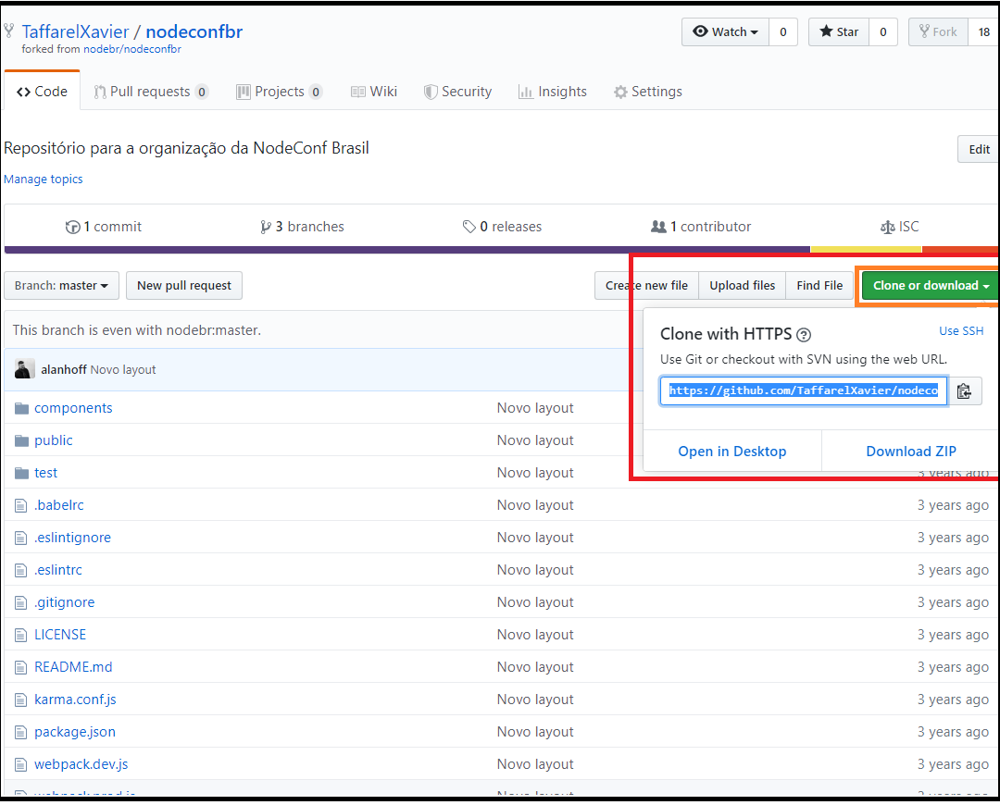

# Como criar um PULL REQUEST no Github?

## 1º Passo)
> "Fork" a página com a qual você quer contribuir, ou até mesmo usar para algum projeto seu. Para isso, entre na página em que você quer e clique em "Fork".
> Aguarde um instante enquanto o processo de __"forking"__ é criado.
> 

## 2º Passo) 
> Após isso, na sua __própria página__, pegar a url para clonar no seu computador.
> 

## 3º Passo)
> Você deve clonar o fork que está no seu projeto, não, do projeto
__oficial__.